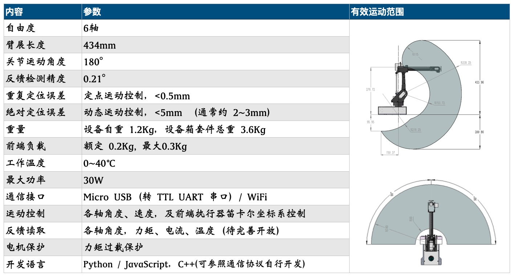

   
简体中文 / [English](docs/README-en.md)

# 7Bot桌面智能机械臂 

 

## 简介
7Bot桌面智能机械臂是一款由松果智能（PineconeAI）团队开发设计的桌面机械臂，适用于AI应用场景的快速搭建、测试和部署，具有丰富的功能和使用灵活性。在人工智能教育及科研领域为学生、教师、研究人员、企业及开发者提供一站式的解决方案，在全球范围使用。

7Bot智能应用视频合集视频 [【Youtube】](https://youtu.be/4htib_-zlBI)    [【B站】](https://player.bilibili.com/player.html?bvid=BV1UU4y1G7TW&page=1)

7Bot机械臂作为通用硬件外设，使用简单易用的二次开发API（应用程序接口），非常方便的在计算机、开发板（如英伟达Jetson系列开发板、树莓派、ARM开发板）等等通用平台上进行二次开发。并无缝结合诸如TensorFlow/Pytorch等深度学习框架、ROS/ROS2机器人操作系统、OpenCV计算机视觉库等等人工智能及机器人应用工具和资源，进行各类型的人工智能应用开发，以及设计原型的快速搭建。

 

## 使用
7Bot机械臂简单易用的方式，灵活多样的场景搭建，很适合用在人工智能、机器人领域的科普上面，能够让中小学生在不用懂得复杂深奥的理论基础知识前提下，即可轻松的操作、使用和体验机器人及人工智能应用的诸多乐趣，提高对理工科的学习兴趣和启发学生的创新思考能力。当前支持的使用方式有：

1. 功能按键：设备内置按键操作功能，通过使用设备底座上的功能按键，即可轻松完成机械臂运动试教和运动控制编排；

2. 图形化编程：7Bo结合Blockly支持图形化编程，可通过图形化界面开发和自定义灵活搭建机械臂应用场景；

3. 3D可视化软件：使用配套的3D可视化软件，可直观的设置机械臂各项参数，同过数字孪生效果直观的看到机器人运动轨迹、机器人状态、机器人控制指令等，并可使用软件功能实现复杂的机械臂任务；

4. 编程开发：支持多种通信方式，配套Python语言编程学习、Jupyter Notebook实验案例，以及运动规划、计算机视觉、深度学习等多种应用主题的课程教学实验。

### 使用说明
| 序号 | 名称    | 内容  | 资源 |
|-----|--------|-------|-------|
| 1   | 7Bot桌面机械臂使用说明   | 机械臂硬件、使用及开发说明  | [使用说明书PDF](docs/7Bot桌面机械臂使用说明书.pdf)、[开箱视频](https://www.bilibili.com/video/BV1W7bvzfEoF/?vd_source=b7bafa4380f12b24bdd421cf737fe045)|
| 2   | 机械臂 Web UI 功能  |   机械臂自带的网页UI界面和功能  | [演示视频](https://www.bilibili.com/video/BV1sjbvz8EZY/) |
| 3   | 功能按键使用  |   机械臂功能按键运动设置   | [演示视频](https://www.bilibili.com/video/BV1W7bvzfE1Z/) |
| 4   | Blockly图形化编程软件     |   机械臂图形化编程，科普教育软件  | [演示视频](https://www.bilibili.com/video/BV1W7bvzfEHT/)、[软件(web版)](APP/Blockly-7Bot.html)  |
| 5   | GUI可视化操作软件     |   机械臂可视化控制、操作软件 | [使用视频V2](https://www.bilibili.com/video/BV1sjbvz8E6A/?vd_source=b7bafa4380f12b24bdd421cf737fe045)、[使用视频V1](https://www.bilibili.com/video/BV1sjbvz8E4P/?vd_source=b7bafa4380f12b24bdd421cf737fe045)、[案例视频](https://www.bilibili.com/video/BV1sjbvz8Exd/?vd_source=b7bafa4380f12b24bdd421cf737fe045)、[软件(web版)](APP/GUI-7Bot.html)  |
| 6   | Python API   |   机械臂Python编程开发接口及案例 |[Python 案例说明](Python_examples/Python_examples.md)、[Python API文档（新）](Python_examples/README_PythonAPI.md) 、[Python编程开发指南（旧版PDF）](docs/7Bot机械臂编程开发指南（Python版）.pdf) |

 

## 外设
7Bot桌面智能机械臂支持多种外设搭配，用于智能应用场景的搭建。

 

## 特性
7Bot桌面智能机械臂具有以下特性和具体参数：

 

 

## 开发指南（待完善）

## 基础案例

基于Python语言的Jupyter Notebook教程，可快速上手7Bot机械臂各项基础功能应用开发。

| 序号 | 名称    | 内容   |
|-----|--------|-------|
| 1   | [轨迹记录及运动复现](demos/轨迹记录及运动复现.md)     |  通过Python API实现机械臂轨迹记录及运动复现   |
| 2   | [机械臂Avatar](demos/机械臂Avatar.md)     |  通过Python API实现一台机械臂多另一台机械臂的Avatar动作同步控制   |
| 3   | [手眼标定](examples/EyeInHandCalibration.md)     | 使用张正友标定法实现机械臂手眼标定   |
| 4   | [轨迹学习训练](demos/轨迹学习训练.md)     | 通过轨迹学习训练，实现机械臂运动控制   |

 

## AI应用案例

| 序号 | 名称    | 内容   |
|------|--------|-------|
| 1      | [井字棋](examples/TicTacToe/TicTacToe.md)     | 使用计算机视觉、深度学习及MinMAX算法，实现机械臂井字棋人机智能对弈 |
| 2      | [传输带分拣](examples/Sorting.md)     | 结合计算机视觉、深度学习以及传输带硬件设备的智能分拣应用 |
| 3      | [手势控制](examples/HandCtrl.md)     | 使用Mediapipe库实现对机械臂的手势控制 |
| 4      | [双臂交互](examples/DualArmHRI.md)     | 结合计算机视觉、深度学习、自然语言和LLM的人机交互系统应用   |
| 5      | [小车移动应用]()     | 机械臂装置在移动平台上，[OmniBot小车]()  |
| 6      | [AGV协同应用]()     | 固定工位取放，AGV搬运，[NanoBot小车]()   |