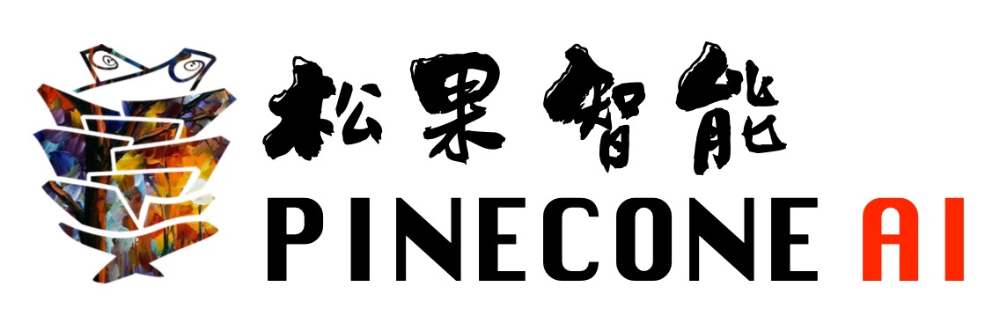
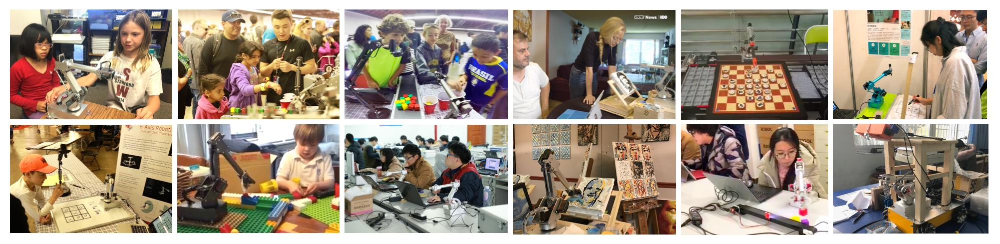
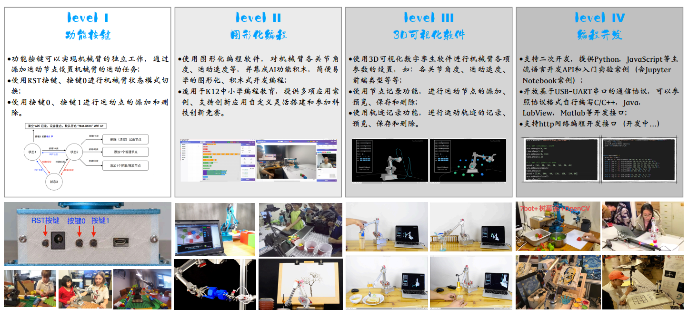
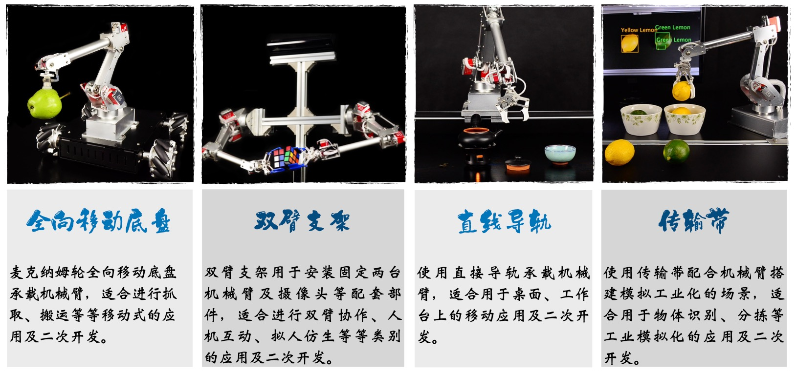
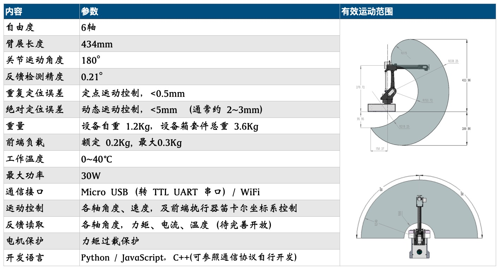

  
[简体中文](../README.md) / English

# 7Bot Desktop Intelligent Robotic Arm

 

## Introduction
The 7Bot Desktop Intelligent Robotic Arm is a desktop robotic arm developed and designed by the PineconeAI team, suitable for rapid setup, testing, and deployment of AI application scenarios, with rich functionality and flexibility of use. It provides a one-stop solution for students, teachers, researchers, enterprises, and developers in the fields of artificial intelligence education and scientific research, and is widely used globally.

7Bot Intelligent Application Video Collection [【Youtube】](https://youtu.be/4htib_-zlBI)    [【Bilibili】](https://player.bilibili.com/player.html?bvid=BV1UU4y1G7TW&page=1)

The 7Bot robotic arm, as a general-purpose hardware peripheral, uses simple and easy-to-use secondary development APIs (Application Programming Interfaces), which can be very conveniently used for secondary development on general platforms such as computers, development boards (such as NVIDIA Jetson series development boards, Raspberry Pi, ARM development boards), etc. It can seamlessly integrate with artificial intelligence and robotics application tools and resources such as TensorFlow/Pytorch deep learning frameworks, ROS/ROS2 robot operating system, OpenCV computer vision library, etc., for various types of artificial intelligence application development and rapid prototyping.

 

## Usage
The simple and easy-to-use approach of the 7Bot robotic arm, with flexible and diverse scenario setups, is very suitable for popularizing artificial intelligence and robotics. It allows primary and secondary school students to easily operate, use, and experience the many joys of robotics and artificial intelligence applications without needing to understand complex and profound theoretical knowledge, thereby increasing interest in STEM subjects and inspiring students' innovative thinking abilities. Currently supported usage methods include:

1. Function buttons: Built-in button operation functions, through the use of function buttons on the device base, you can easily complete robotic arm motion teaching and motion control arrangement;

2. Graphical programming: 7Bot combines with Blockly to support graphical programming, allowing development and customization of flexible robotic arm application scenarios through a graphical interface;

3. 3D visualization software: Using the accompanying 3D visualization software, you can intuitively set various parameters of the robotic arm, visually see the robot's motion trajectory, robot status, robot control commands, etc. through digital twin effects, and use software functions to implement complex robotic arm tasks;

4. Programming development: Supports multiple communication methods, comes with Python language programming learning, Jupyter Notebook experimental cases, as well as course teaching experiments on various application topics such as motion planning, computer vision, and deep learning.

### Usage Instructions
| No. | Name    | Content  | Resources |
|-----|--------|-------|-------|
| 1   | 7Bot Desktop Robotic Arm User Manual   | Hardware, usage, and development instructions for the robotic arm  | [User Manual PDF](7Bot桌面机械臂使用说明书.pdf)、[Unboxing Video](https://www.bilibili.com/video/BV1W7bvzfEoF/?vd_source=b7bafa4380f12b24bdd421cf737fe045)|
| 2   | Robotic Arm Web UI Functions  |   Web UI interface and functions built into the robotic arm  | [Demo Video](https://www.bilibili.com/video/BV1sjbvz8EZY/) |
| 3   | Function Button Usage  |   Robotic arm function button motion settings   | [Demo Video](https://www.bilibili.com/video/BV1W7bvzfE1Z/) |
| 4   | Blockly Graphical Programming Software     |   Robotic arm graphical programming, popular science education software  | [Demo Video](https://www.bilibili.com/video/BV1W7bvzfEHT/)、[Software (Web Version)](../APP/Blockly-7Bot.html)  |
| 5   | GUI Visualization Operation Software     |   Robotic arm visualization control and operation software | [Usage Video V2](https://www.bilibili.com/video/BV1sjbvz8E6A/?vd_source=b7bafa4380f12b24bdd421cf737fe045)、[Usage Video V1](https://www.bilibili.com/video/BV1sjbvz8E4P/?vd_source=b7bafa4380f12b24bdd421cf737fe045)、[Case Video](https://www.bilibili.com/video/BV1sjbvz8Exd/?vd_source=b7bafa4380f12b24bdd421cf737fe045)、[Software (Web Version)](../APP/GUI-7Bot.html)  |
| 6   | Python API   |   Robotic arm Python programming development interface and cases |[Python Case Instructions](../Python_examples/Python_examples.md)、[Python API Documentation (New)](../Python_examples/README_PythonAPI.md) 、[Python Programming Development Guide (Old PDF Version)](7Bot机械臂编程开发指南（Python版）.pdf) |

 

## Peripherals
The 7Bot Desktop Intelligent Robotic Arm supports a variety of peripheral configurations for building intelligent application scenarios.

 

## Features
The 7Bot Desktop Intelligent Robotic Arm has the following features and specific parameters:

 

 

## Development Guide (To be completed)

## Basic Cases

Jupyter Notebook tutorials based on Python language, for quickly getting started with various basic functional application development of the 7Bot robotic arm.

| No. | Name    | Content   |
|-----|--------|-------|
| 1   | [Trajectory Recording and Motion Reproduction](../demos/轨迹记录及运动复现.md)     |  Implement robotic arm trajectory recording and motion reproduction through Python API   |
| 2   | [Robotic Arm Avatar](../demos/机械臂Avatar.md)     |  Implement Avatar motion synchronization control of one robotic arm over another through Python API   |
| 3   | [Eye-in-Hand Calibration](../examples/EyeInHandCalibration.md)     | Implement robotic arm eye-in-hand calibration using Zhang's calibration method   |
| 4   | [Trajectory Learning Training](../demos/轨迹学习训练.md)     | Implement robotic arm motion control through trajectory learning training   |

 

## AI Application Cases

| No. | Name    | Content   |
|------|--------|-------|
| 1      | [Tic-Tac-Toe](../examples/TicTacToe/TicTacToe.md)     | Implement intelligent human-machine Tic-Tac-Toe game using computer vision, deep learning, and MinMax algorithm |
| 2      | [Conveyor Belt Sorting](../examples/Sorting.md)     | Intelligent sorting application combining computer vision, deep learning, and conveyor belt hardware devices |
| 3      | [Gesture Control](../examples/HandCtrl.md)     | Implement gesture control of the robotic arm using the Mediapipe library |
| 4      | [Dual-Arm Interaction](../examples/DualArmHRI.md)     | Human-robot interaction system application combining computer vision, deep learning, natural language, and LLM   |
| 5      | [Mobile Platform Application]()     | Robotic arm mounted on mobile platform, [OmniBot Vehicle]()  |
| 6      | [AGV Collaborative Application]()     | Fixed workstation pick and place, AGV transportation, [NanoBot Vehicle]()   |